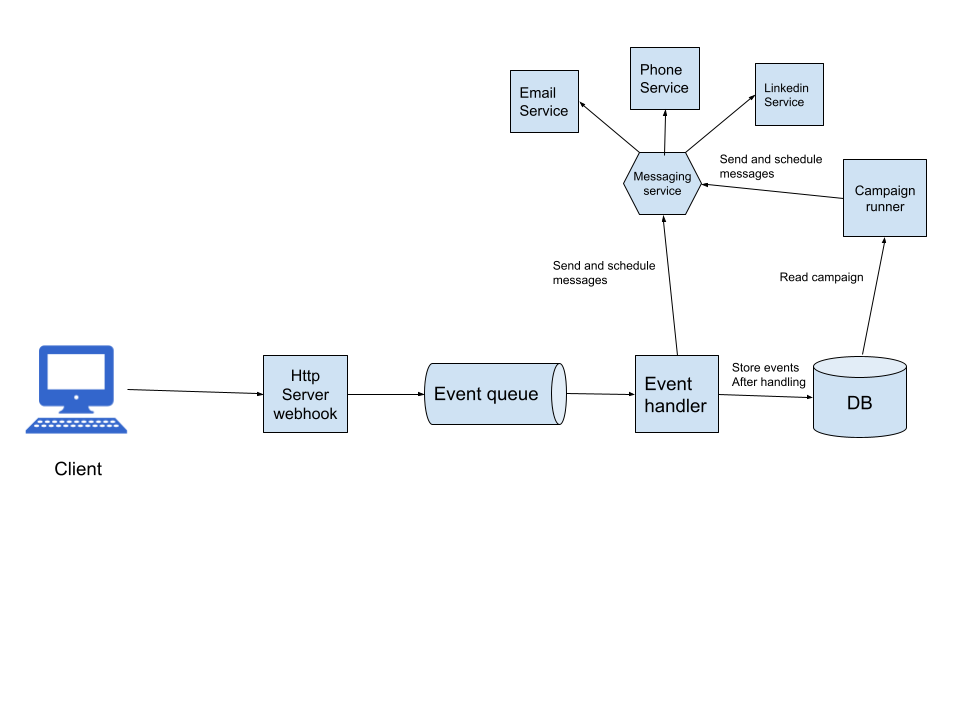

Dynamic Campaign management
===========================

## Design

This is an example of microservice ready Dynamic Campaign management system that consist of:

- Http Webhook Server (Flask/Django/express.js) that listens for webhooks from client on user events
    
- Event queue (RabbitMQ - de-facto standard in the industry)
- DB (MongoDB/DynamoDB - As we have flexible schema and not much need for joins between documents, it'll be simple and performant)
- Event handler - a worker that listens for events from queue and processes them
    - Messaging service - module responsible for sending messages and calls.start off we can use SendGrid or other SaaS and migrate to in house SMTP server when ready
    - Campaign runner - module responsible for running campaigns

### Deployment

Option 1 (start off):
- Http Webhook Server and Event handler (with Messaging and Campaign runner) can be run in AWS as multidocker container ElasticBeanstalk application
- MongoDB deployed to Mongo Atlas (Cloud)
- RabbitMQ deployed to AWS AmazonMQ

Option 2 (scaling up):
All conponents can be run as K8s cluster,
messaging and campaign runner extracted into separate services

### Data structures

Model schemas are in pseudo code in [model](model).

### Dynamically customizing content based on data related to companies/prospects

We can use Jinja for content templating.

### Logic for executing the campaign

Please find it in [campaign_runner.py](campaign_runner.py).

### Scheduling

Messaging and Campaign Runner need to perform scheduled tasks.
To start off we can go with cron jobs running every 5 minutes that correspondigly fetches new messages to be sent / campaigns to be run and executes them.   
Alternatively we can use scheduling framework similar to Agenda.js or Quartz (I used them in previous projects).   
Or we can even communicate sending messages using dedicated RabbitMQ queue with [delayed message exchange extension](https://github.com/rabbitmq/rabbitmq-delayed-message-exchange/) for scheduling 

## Coding

### General comments

This architecture embraces Event Sourcing, that is we store events as is in db and hydrate the state on server starts.   
The single source of truth for handling events and hydrating the state is [EventHandler](event_handler.py).

### Assumptions

- Account = Prospect

### How to run
1. (Optionally) Update config.json
2. (Optionally) Update events in main.py
3. Run the script python main.py and see the results in the console
